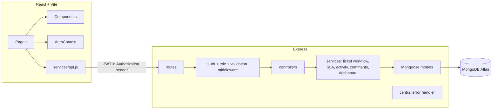
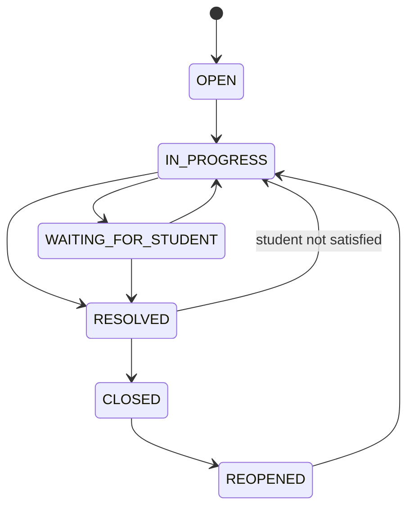

# Architecture

## System overview

## Frontend architecture
- **Routing:** `react-router-dom` v6. `ProtectedRoute` gates authenticated + role-specific routes; `PublicOnlyRoute` keeps logged-in users off `/login` and `/register`. These are UI convenience only — the backend is the real authority.
- **State:** `AuthContext` holds the current user and token lifecycle (login, register, logout, session restore via `/api/auth/me`). `ToastContext` provides global notifications. No Redux — plain Context plus local component state was sufficient.
- **Data fetching:** a thin `services/*.js` layer wraps `axios`; a shared `useFetch` hook standardizes loading/error/data for read screens.
- **Design system:** Tailwind utility classes, a small set of reusable components (`Badge`, `StatusBadge`, `PriorityBadge`, `SlaBadge`, `Section`, `EmptyState`, `ErrorState`, `ConfirmDialog`, etc.).

## Backend architecture
Layering: `route → controller → service → model`. Controllers stay thin (validate input, call a service, shape the response). Business logic (workflow rules, SLA math, activity logging) lives in `services/`.

## API layer
Consistent response shape: `{ success: true, data }` or `{ success: false, message, errors? }`. Central `errorHandler.js` normalizes Mongoose/validation/cast/duplicate-key errors into that shape and never leaks stack traces to the client.

| Area | Endpoints |
|---|---|
| Auth | `POST /api/auth/register`, `POST /api/auth/login`, `GET /api/auth/me` |
| Tickets | `POST /api/tickets`, `GET /api/tickets`, `GET /api/tickets/:id`, `PATCH /api/tickets/:id` (priority) |
| Workflow | `PATCH /api/tickets/:id/status`, `PATCH /api/tickets/:id/assign` |
| Comments | `POST/GET /api/tickets/:id/comments` |
| Activity | `GET /api/tickets/:id/activity` |
| Users | `GET /api/users/staff` |
| Dashboard | `GET /api/dashboard/{student,staff,manager}` |

## Authentication flow
Register/login issue a JWT signed with `JWT_SECRET`, containing only the user's ID as `sub`. `protect` middleware verifies the token and reloads the user from MongoDB on every request — the role is never trusted from the token itself.

## Authorization flow
`authorize(...roles)` gates routes by role. Ownership checks (a student's own ticket, a staff member's assigned ticket) live in the service layer, not the route layer, so the same rule applies no matter which endpoint is hit.

## Database model
`User`, `Ticket`, `Comment`, `Activity`, plus a small `Counter` collection for atomic, gapless ticket numbers (`EDU-2026-00001`). See `server/models/*.js` for full schemas.

## Ticket lifecycle

Enforced server-side via a transition map plus a conditional `findOneAndUpdate` (matches on the ticket's current status) to guard against two simultaneous status changes racing each other.

## SLA calculation
`slaDueAt = slaStartedAt + SLA_HOURS[priority]`. Recalculated on priority change and on reopen. State (`ON_TRACK`/`AT_RISK`/`BREACHED`/`MET`) is computed on read, never stored, so it's always accurate without a background job.

## Activity logging
Every meaningful action (create, assign, reassign, priority change, status change, resolve, close, reopen, comment) writes an `Activity` document. Comment text itself is never copied into the activity log, so internal notes can't leak through the timeline to a student.

## Error handling
All async controllers are wrapped in `asyncHandler`; all errors funnel through one `errorHandler.js` that maps known error types to clean, user-safe messages and 500s everything else with a generic message (full detail is logged server-side only).

## Security considerations
- Passwords hashed with bcrypt (10 rounds), never stored or returned in plaintext.
- JWT-based auth; token subject is a user ID only.
- Role-based authorization enforced server-side on every protected route.
- Input validation on both client and server (server is authoritative).
- Secrets kept out of Git via `.gitignore`; `.env.example` provided.
- `helmet` for basic HTTP security headers; CORS restricted to `CLIENT_URL`.
- **Limitations (not enterprise-grade):** no rate limiting, no refresh-token rotation, JWT stored in `localStorage` (XSS-exposed), no CSRF protection (not needed for a pure JSON API with bearer tokens, but noted).

## Trade-offs
See `README.md` → Trade-offs.

## Future improvements
See `README.md` → Future Improvements.